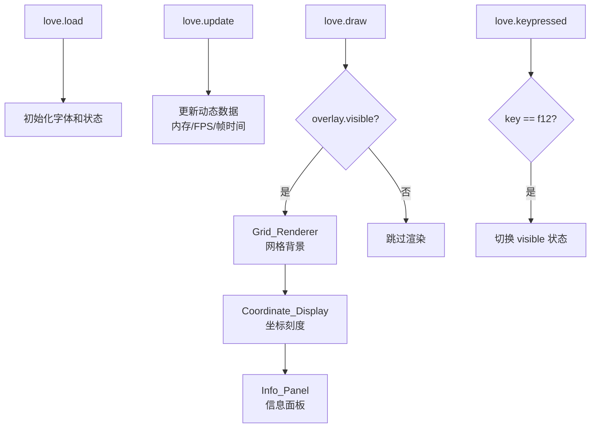

# 设计文档

## 概述

本设计文档描述 LÖVE2D 调试信息覆盖层（Debug Overlay）的技术实现方案。该模块以单文件 Lua 脚本形式存在于 `test/main.lua`，在游戏运行时以半透明覆盖层渲染网格背景、坐标系刻度、以及系统/性能信息面板。用户可通过 F12 键切换覆盖层的显示与隐藏。

核心设计目标：
- 单文件实现，无外部依赖
- 利用 LÖVE2D 原生 API（love.graphics、love.timer、love.system 等）
- 模块化内部结构，各组件职责清晰
- 渲染开销极低，不影响宿主游戏性能

## 架构

采用单文件模块化架构，通过 Lua table 将功能划分为独立组件。所有组件在 `love.draw()` 回调中按层级顺序渲染。



渲染层级（从底到顶）：
1. Grid_Renderer — 网格线（最底层）
2. Coordinate_Display — 坐标轴刻度标签
3. Info_Panel — 信息面板（最顶层，右上角）

## 组件与接口

### 1. DebugOverlay（主控制器）

顶层状态管理，协调所有子组件。

```lua
local overlay = {
    visible = true,       -- 默认可见（需求 9.5）
    font = nil,           -- 等宽字体对象
    fontSize = 12,        -- 字体大小（像素）
    gridSize = 50,        -- 网格间距（像素）
}
```

接口：
- `overlay.load()` — 在 `love.load` 中调用，初始化字体等资源
- `overlay.draw()` — 在 `love.draw` 中调用，按层级渲染所有组件
- `overlay.keypressed(key)` — 在 `love.keypressed` 中调用，处理 F12 切换

### 2. Grid_Renderer（网格渲染器）

负责绘制覆盖整个窗口的等间距网格线。

```lua
local grid = {}
function grid.draw(gridSize)
    -- 获取窗口尺寸: love.graphics.getDimensions()
    -- 设置半透明颜色: love.graphics.setColor(1, 1, 1, 0.15)
    -- 绘制垂直线: love.graphics.line(x, 0, x, h)
    -- 绘制水平线: love.graphics.line(0, y, w, y)
end
```

关键 API：
- `love.graphics.getDimensions()` — 获取当前窗口宽高
- `love.graphics.setColor(r, g, b, a)` — 设置绘制颜色（含 alpha）
- `love.graphics.line(x1, y1, x2, y2)` — 绘制线段

### 3. Coordinate_Display（坐标系显示）

在网格交叉点处标注像素坐标值。

```lua
local coords = {}
function coords.draw(gridSize, font)
    -- X 轴标签：沿窗口顶部，每个网格线位置打印 x 值
    -- Y 轴标签：沿窗口左侧，每个网格线位置打印 y 值
    -- 原点标记：在 (0,0) 处绘制特殊标识（小十字或圆点）
end
```

关键 API：
- `love.graphics.print(text, x, y)` — 绘制文本
- `love.graphics.circle("fill", x, y, r)` — 绘制原点标记

### 4. Info_Panel（信息面板）

在右上角以半透明深色背景渲染所有系统/性能信息。

```lua
local panel = {}
function panel.draw(font)
    local w = love.graphics.getWidth()
    local lines = panel.collectInfo()
    -- 计算面板尺寸
    -- 绘制半透明背景: love.graphics.rectangle("fill", ...)
    -- 逐行绘制信息文本
end

function panel.collectInfo()
    -- 返回 {label, value} 对的数组
end
```

信息采集函数映射：

| 信息项 | LÖVE2D API | 格式 |
|--------|-----------|------|
| Lua 版本 | `_VERSION` | 直接显示字符串 |
| LuaJIT 版本 | `jit.version`（需 pcall 保护） | 字符串或 "N/A" |
| JIT 状态 | `jit.status()`（需 pcall 保护） | "Enabled" / "Disabled" / "N/A" |
| 内存使用 | `collectgarbage("count")` | "%.2f KB" 或 "%.2f MB" |
| CPU 核心数 | `love.system.getProcessorCount()` | 整数 |
| FPS | `love.timer.getFPS()` | 整数 |
| 帧时间 | `love.timer.getAverageDelta()` | "%.2f ms" |
| 操作系统 | `love.system.getOS()` | 字符串 |
| LÖVE 版本 | `love.getVersion()` | "major.minor.revision" |
| 渲染器 | `love.graphics.getRendererInfo()` | name, version, vendor, device |


## 数据模型

本项目不涉及持久化数据存储。所有数据为运行时状态，存储在 Lua table 中。

### 覆盖层状态

```lua
local state = {
    visible = true,          -- bool: 覆盖层是否可见
    font = nil,              -- Font: 等宽字体对象（love.load 时创建）
    fontSize = 12,           -- number: 字体大小
    gridSize = 50,           -- number: 网格间距（像素）
    gridColor = {1, 1, 1, 0.15},  -- table: 网格线颜色 RGBA
    labelColor = {1, 1, 1, 0.6},  -- table: 坐标标签颜色
    panelBg = {0, 0, 0, 0.7},     -- table: 面板背景颜色
    panelTextColor = {1, 1, 1, 0.9}, -- table: 面板文字颜色
    panelPadding = 10,       -- number: 面板内边距
    panelMargin = 10,        -- number: 面板外边距
}
```

### 信息行数据结构

```lua
-- panel.collectInfo() 返回值格式
local infoLines = {
    { label = "Lua Version",  value = "Lua 5.1" },
    { label = "LuaJIT",       value = "LuaJIT 2.1.0-beta3" },
    { label = "JIT Status",   value = "Enabled" },
    { label = "Memory",       value = "1234.56 KB (1.21 MB)" },
    { label = "CPU Cores",    value = "8" },
    { label = "FPS",          value = "60" },
    { label = "Frame Time",   value = "16.67 ms" },
    { label = "OS",           value = "Windows" },
    { label = "LÖVE Version", value = "11.5.0" },
    { label = "Renderer",     value = "OpenGL" },
    { label = "GL Version",   value = "4.6.0" },
    { label = "GPU Vendor",   value = "NVIDIA" },
    { label = "GPU Device",   value = "GeForce RTX 3080" },
}
```

### 设计决策说明

1. **单文件架构**：所有组件定义在同一个 `main.lua` 中，使用 local table 实现模块化。这简化了部署（只需复制一个文件），同时保持代码组织清晰。

2. **字体选择**：使用 `love.graphics.newFont(size)` 创建默认字体（LÖVE2D 内置的 Vera Sans Mono），大小 12px。该字体等宽且在小尺寸下可读性好，满足需求 9.3 的要求。

3. **LuaJIT 检测**：通过 `pcall` 安全访问全局 `jit` 表。LÖVE2D 默认使用 LuaJIT，但设计上需要兼容 jit 不可用的情况（需求 4.3）。

4. **内存单位自动切换**：当内存超过 1024 KB 时，同时显示 KB 和 MB 值（需求 5.4）。`collectgarbage("count")` 返回 KB 值。

5. **网格线 alpha 值**：选择 0.15（在 0.1-0.3 范围内），既能看清网格又不遮挡游戏内容（需求 1.2）。

6. **面板位置**：固定在右上角，通过 `love.graphics.getWidth()` 动态计算 x 坐标，确保窗口缩放时面板始终贴靠右侧（需求 9.2）。

7. **性能考量**：所有绘制操作使用 LÖVE2D 原生 API，无额外内存分配。`collectInfo()` 每帧调用但只做简单的 API 查询和字符串格式化，开销可忽略（需求 9.4）。


## 正确性属性

*属性（Property）是在系统所有合法执行中都应成立的特征或行为——本质上是对系统应做什么的形式化陈述。属性是人类可读规格说明与机器可验证正确性保证之间的桥梁。*

### Property 1: 网格线位置覆盖整个窗口

*对于任意*正整数窗口宽度 w、高度 h 和网格间距 gridSize，计算出的垂直网格线 x 坐标集合应包含从 gridSize 开始、以 gridSize 为步长、直到小于 w 的所有值；水平网格线 y 坐标集合同理应覆盖从 gridSize 到小于 h 的所有值。

**验证: 需求 1.1, 1.3**

### Property 2: 坐标轴标签与网格位置一致

*对于任意*正整数窗口尺寸和网格间距，生成的 X 轴标签集合中每个标签的位置应为 gridSize 的整数倍，且标签显示的数值应等于该位置的像素坐标（整数）；Y 轴标签同理。

**验证: 需求 2.1, 2.2, 2.3**

### Property 3: 内存格式化与单位转换

*对于任意*正浮点数 memKB（表示 KB 内存值），格式化函数的输出应满足：(a) 始终包含格式为 "X.XX KB" 的字符串，其中 X.XX 是 memKB 保留两位小数的值；(b) 当且仅当 memKB > 1024 时，输出还应包含 "Y.YY MB" 的字符串，其中 Y.YY 等于 memKB / 1024 保留两位小数的值。

**验证: 需求 5.1, 5.3, 5.4**

### Property 4: 帧时间秒转毫秒格式化

*对于任意*非负浮点数 deltaSec（表示秒为单位的帧时间），格式化函数的输出应为 "X.XX ms" 格式，其中 X.XX 等于 deltaSec × 1000 保留两位小数的值。

**验证: 需求 7.2**

### Property 5: F12 切换可见性的往返性

*对于任意*布尔值 visible，执行一次切换操作后 visible 应变为 not visible；执行两次切换操作后应恢复为原始值。

**验证: 需求 9.1**

### Property 6: 信息面板右上角定位

*对于任意*正整数窗口宽度 windowWidth、正整数面板宽度 panelWidth 和非负整数边距 margin，面板的 x 坐标应等于 windowWidth - panelWidth - margin。

**验证: 需求 9.2**

## 错误处理

### LuaJIT 不可用

当全局 `jit` 表不存在时（非 LuaJIT 运行时），使用 `pcall` 安全检测：

```lua
local hasJit, jitVersion, jitStatus
hasJit = type(jit) == "table"
if hasJit then
    jitVersion = jit.version or "Unknown"
    jitStatus = jit.status() and "Enabled" or "Disabled"
else
    jitVersion = "N/A"
    jitStatus = "N/A"
end
```

### 窗口尺寸为零

理论上 `love.graphics.getDimensions()` 不会返回零（LÖVE2D 保证最小窗口尺寸），但网格绘制循环使用 `for x = gridSize, w, gridSize` 的形式，当 w < gridSize 时循环自然不执行，无需额外处理。

### API 调用失败

所有 LÖVE2D API 调用（`love.timer.getFPS()`、`love.system.getOS()` 等）在正常运行时不会失败。若模块未加载（如 `love.conf` 中禁用了 `love.system`），对应信息行显示 "N/A"。

## 测试策略

### 属性测试（Property-Based Testing）

使用 [luacheck](https://github.com/mpeterv/luacheck) 进行静态分析，使用自定义的轻量级属性测试框架进行运行时验证。由于 Lua 生态中没有广泛使用的 PBT 库（如 QuickCheck），我们将实现一个简单的随机测试运行器：

```lua
-- 简易属性测试运行器
local function checkProperty(name, numTests, generator, property)
    for i = 1, numTests do
        local input = generator()
        local ok, err = pcall(property, input)
        if not ok then
            error(string.format("Property '%s' failed on test %d: %s\nInput: %s",
                name, i, err, tostring(input)))
        end
    end
end
```

每个正确性属性对应一个属性测试，最少运行 100 次迭代。

测试标签格式：`-- Feature: love2d-debug-overlay, Property N: <属性描述>`

### 属性测试覆盖

| 属性 | 测试方法 | 生成器 |
|------|---------|--------|
| Property 1: 网格线覆盖 | 随机窗口尺寸 + 网格间距，验证线位置 | w∈[1,4000], h∈[1,4000], gridSize∈[10,200] |
| Property 2: 坐标标签一致 | 随机窗口尺寸 + 网格间距，验证标签值 | 同上 |
| Property 3: 内存格式化 | 随机正浮点数，验证输出格式 | memKB∈[0.01, 100000] |
| Property 4: 帧时间格式化 | 随机非负浮点数，验证输出格式 | delta∈[0, 1.0] |
| Property 5: 切换往返 | 随机布尔值，验证双重切换 | true/false |
| Property 6: 面板定位 | 随机窗口宽度和面板宽度，验证 x 坐标 | w∈[100,4000], pw∈[50,500], margin∈[0,50] |

### 单元测试

针对具体示例和边界情况：

- LuaJIT 可用时显示版本和状态
- LuaJIT 不可用时显示 "N/A"
- 内存恰好等于 1024 KB 时的显示（边界）
- 内存小于 1024 KB 时只显示 KB
- FPS 和帧时间的具体值验证
- LÖVE 版本格式化（major.minor.revision）
- 渲染器信息 4 个字段的显示
- 初始状态 visible = true
- 字体大小在 10-14 范围内
- 网格颜色 alpha 在 0.1-0.3 范围内

### 手动测试

- 窗口缩放时网格和面板的响应
- F12 键切换的视觉效果
- 覆盖层对游戏帧率的影响（需求 9.4）
- 原点 (0,0) 标记的可见性
- 面板文字在深色背景上的可读性
